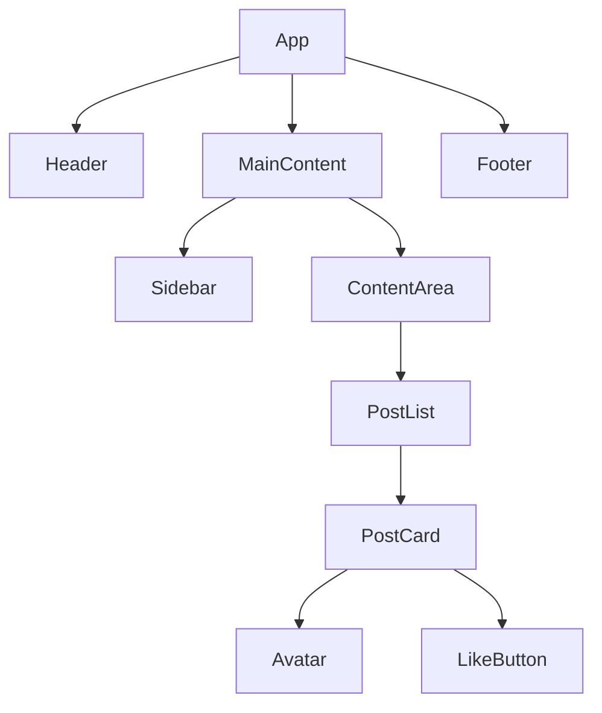
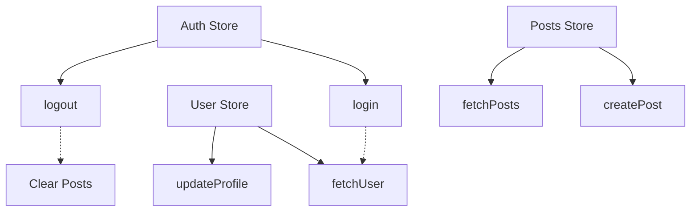
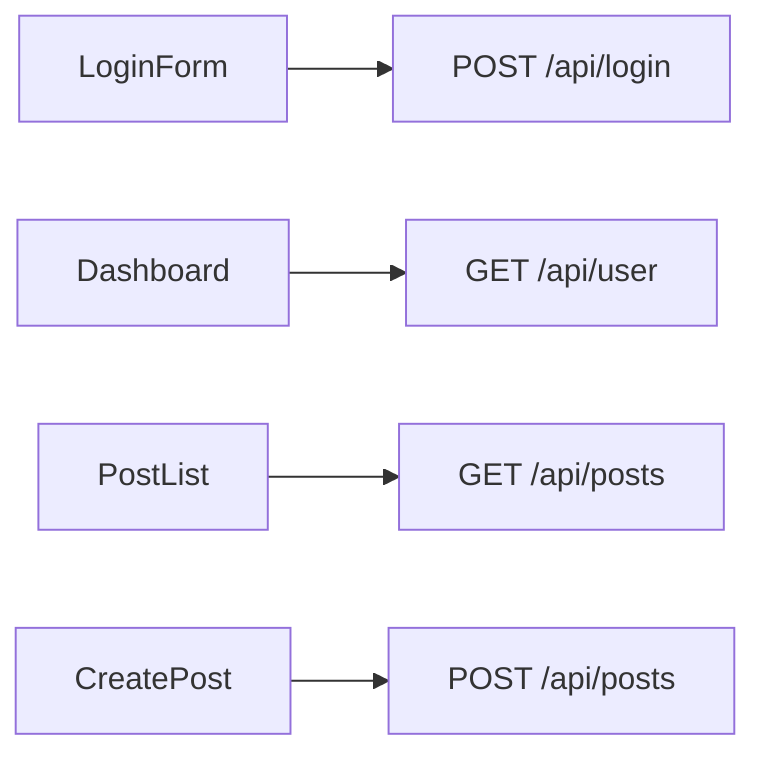

# React Frontend Documentation Generators

## Overview
Documentation generators specifically for React frontend projects.

---

## Generators for React Projects

### 1. **update_components.py** (Frontend Version)
**Output:** `docs/components.mmd`

**Scans:**
- `src/components/**/*.jsx` and `*.tsx`
- Component imports and dependencies
- Props interfaces (TypeScript)
- Component composition (parent-child)

**Generates:**


**Implementation Notes:**
- Parse `import` statements for dependencies
- Extract `interface Props` for TypeScript
- Detect `children` prop for composition
- Build component tree via import chain
- Color-code: Pages, Layouts, Components, UI elements

---

### 2. **update_routes.py**
**Output:** `docs/routes.mmd`

**Scans:**
- React Router: `App.jsx`, `routes.jsx`, `router.jsx`
- Next.js: `app/` directory (file-based routing)
- Remix: `app/routes/` directory

**Generates:**
```mermaid
graph LR
  Root[/] --> Home
  Root --> Login
  Root --> Dashboard

  Dashboard --> Profile
  Dashboard --> Settings
  Dashboard --> Posts

  Posts --> PostDetail[/posts/:id]
  PostDetail --> EditPost[/posts/:id/edit]
```

**Implementation Notes:**
- Parse `<Route path="..." element={...} />`
- Detect nested routes via `<Routes>` nesting
- Extract route guards/loaders
- Mark protected routes (auth required)
- Detect lazy-loaded routes (`React.lazy()`)

---

### 3. **update_state.py**
**Output:** `docs/state.mmd`

**Scans:**
- **Redux:** `src/store/`, `src/slices/`, `configureStore`
- **Redux Toolkit:** `createSlice`, `createAsyncThunk`
- **Zustand:** `create()` stores
- **Context API:** `createContext`, `useContext`
- **Jotai/Recoil:** atoms

**Generates:**


**Implementation Notes:**
- Parse Redux `createSlice()` for actions
- Extract Zustand store methods
- Map state dependencies (cross-store actions)
- Show async actions (thunks)
- Indicate state shape in comments

---

### 4. **update_design_tokens.py**
**Output:** `docs/design-tokens.md`

**Scans:**
- Tailwind config: `tailwind.config.js`
- CSS variables: `:root { --color-primary: ... }`
- Theme files: `src/theme.js`, `src/styles/tokens.js`
- Styled-components theme: `const theme = { ... }`

**Generates:**
```markdown
# Design Tokens

## Colors
--color-primary: #3B82F6
--color-secondary: #10B981

## Typography
--font-sans: 'Inter', sans-serif
--text-base: 1rem

## Spacing
--spacing-4: 1rem
--spacing-8: 2rem

## Components
--button-height: 2.5rem
--input-border-radius: 0.5rem
```

**Implementation Notes:**
- Parse Tailwind `theme.extend`
- Extract CSS custom properties
- Read theme object exports
- Group by category (colors, typography, spacing)
- Include component-specific tokens

---

### 5. **update_api_calls.py** (OPTIONAL)
**Output:** `docs/api-calls.mmd`

**Scans:**
- `fetch()` calls in components
- Axios instances: `axios.get('/api/...')`
- React Query: `useQuery`, `useMutation`
- SWR: `useSWR('/api/...')`

**Generates:**


**Implementation Notes:**
- Parse `fetch()` and `axios` calls
- Extract API endpoints from strings
- Map components to their API calls
- Show HTTP methods
- Group by endpoint/resource

---

## File Structure

```
.claude/resources/2-code/scripts/
├── update_components.py       (Frontend version)
├── update_routes.py           (React Router)
├── update_state.py            (Redux/Zustand)
├── update_design_tokens.py
└── update_api_calls.py        (Optional)
```

---

## Priority Implementation

1. **HIGH:** `update_components.py` (frontend) - Component tree
2. **HIGH:** `update_routes.py` - Navigation map
3. **MEDIUM:** `update_state.py` - State management
4. **MEDIUM:** `update_design_tokens.py` - Design system
5. **LOW:** `update_api_calls.py` - API usage map

---

## Dependencies Detection

**package.json markers:**
```json
{
  "dependencies": {
    "react": "^18.0.0",
    "react-router-dom": "^6.0.0",  // → routes generator
    "redux": "^4.0.0",              // → state generator (Redux)
    "zustand": "^4.0.0",            // → state generator (Zustand)
    "tailwindcss": "^3.0.0"         // → design-tokens generator
  }
}
```

---

*Planning document - Not yet implemented*
