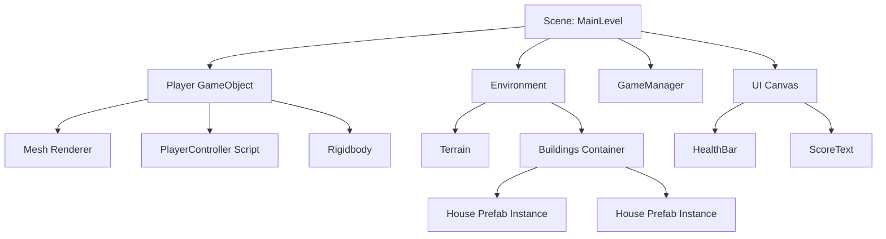
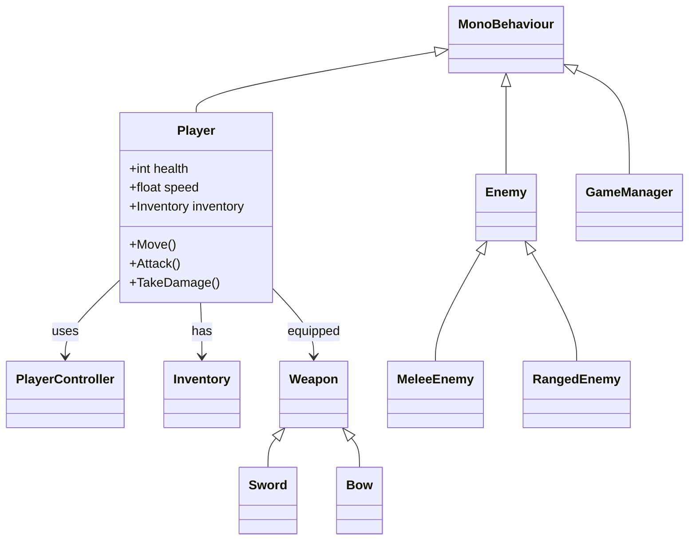
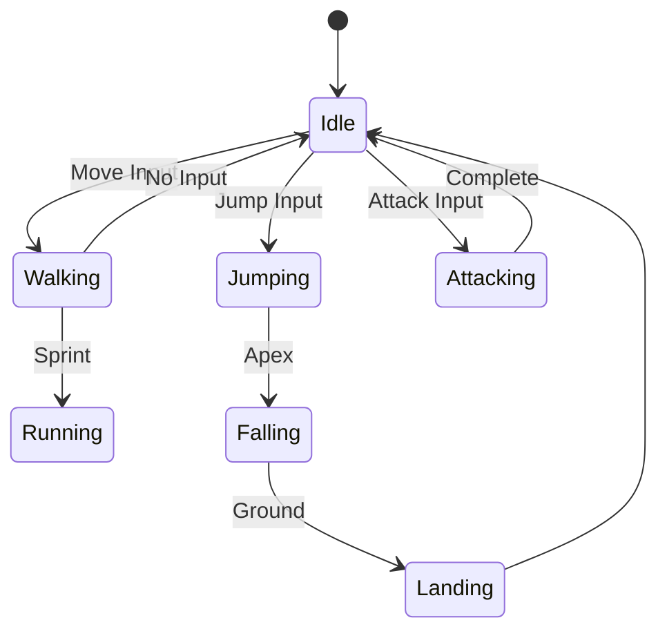

# Unity Game Documentation Generators

## Overview
Documentation generators specifically for Unity game engine projects (C# scripts, scenes, prefabs).

---

## Generators for Unity Projects

### 1. **update_scenes.py**
**Output:** `docs/scenes.mmd`

**Scans:**
- `Assets/Scenes/*.unity` files
- Scene hierarchy (GameObjects)
- Component attachments
- Prefab instances

**Generates:**

**Implementation Notes:**
- Parse `.unity` scene files (YAML format)
- Extract GameObject hierarchy
- Show attached components (scripts, renderers, colliders)
- Mark prefab instances vs regular GameObjects
- Show parent-child relationships
- Color-code: Player, Environment, UI, Managers, Prefabs

---

### 2. **update_game_classes.py**
**Output:** `docs/game-classes.mmd`

**Scans:**
- `Assets/Scripts/**/*.cs`
- Class definitions and inheritance
- MonoBehaviour classes
- ScriptableObject classes
- Interfaces and abstract classes

**Generates:**

**Implementation Notes:**
- Parse C# class definitions
- Extract: classes, fields, methods, properties
- Detect inheritance (`class Player : MonoBehaviour`)
- Show composition (`has`, `uses`, `equipped`)
- Identify MonoBehaviour vs regular classes
- Extract public fields (Inspector-visible)

---

### 3. **update_state_machines.py**
**Output:** `docs/state-machines.mmd`

**Scans:**
- Animator Controllers (`*.controller`)
- State machine scripts (custom implementations)
- Enemy AI states
- Player states

**Generates:**

**Implementation Notes:**
- Parse Animator Controller files (YAML)
- Extract states, transitions, parameters
- Detect custom state machine scripts
- Show trigger conditions
- Map state → animation clips
- Support multiple state machines (Player, Enemy, Boss)

---

## Priority Implementation

1. **HIGH:** `update_scenes.py` - Scene hierarchy
2. **HIGH:** `update_game_classes.py` - C# class diagram
3. **MEDIUM:** `update_state_machines.py` - AI states

---

## Unity Project Detection

**Markers:**
- `Assets/` folder exists
- `ProjectSettings/` folder exists
- `*.csproj` files (Unity-generated)
- `Packages/manifest.json` exists

---

*Planning document - Not yet implemented*
