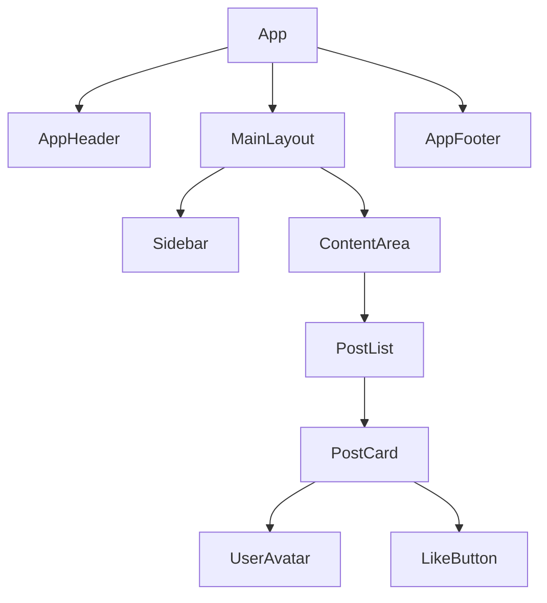
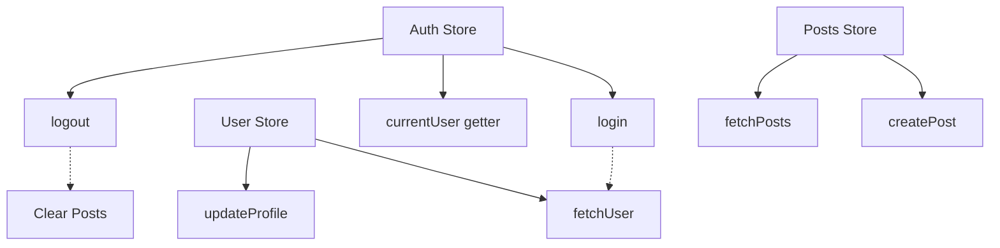

# Vue Frontend Documentation Generators

## Overview
Documentation generators specifically for Vue.js frontend projects (Vue 2 and Vue 3).

---

## Generators for Vue Projects

### 1. **update_components.py** (Vue Version)
**Output:** `docs/components.mmd`

**Scans:**
- `src/components/**/*.vue`
- Component imports and registration
- Props definitions
- Composables (Vue 3)
- Mixins (Vue 2)

**Generates:**


**Implementation Notes:**
- Parse `.vue` files (template, script, style)
- Extract `props:` definitions
- Detect component registration (local/global)
- Map composable usage (`useAuth`, `useUser`)
- Identify slots and scoped slots
- Color-code: Pages, Layouts, Components, UI

---

### 2. **update_routes.py** (Vue Router)
**Output:** `docs/routes.mmd`

**Scans:**
- Vue Router: `src/router/index.js`
- Route definitions in `createRouter()`
- Nested routes via `children: []`
- Nuxt: `pages/` directory (file-based)

**Generates:**
```mermaid
graph LR
  Root[/] --> Home
  Root --> Login
  Root --> Dashboard

  Dashboard --> Profile[/dashboard/profile]
  Dashboard --> Settings[/dashboard/settings]

  Settings --> Account[/dashboard/settings/account]
  Settings --> Security[/dashboard/settings/security]
```

**Implementation Notes:**
- Parse `createRouter({ routes: [...] })`
- Extract `path`, `name`, `component`
- Detect navigation guards (`beforeEnter`)
- Mark meta fields (auth required)
- Show lazy-loaded routes (`() => import(...)`)
- Nuxt: scan `pages/` folder structure

---

### 3. **update_state.py** (Vuex/Pinia)
**Output:** `docs/state.mmd`

**Scans:**
- **Vuex:** `src/store/index.js`, `modules/`
- **Pinia:** `src/stores/`, `defineStore()`
- State, getters, actions, mutations

**Generates:**


**Implementation Notes:**
- **Vuex:**
  - Parse `modules: { auth, user, posts }`
  - Extract `state`, `getters`, `actions`, `mutations`
  - Show module namespacing
- **Pinia:**
  - Parse `defineStore('auth', { ... })`
  - Extract state properties and actions
  - No mutations (Pinia uses direct state mutation)
- Map cross-store dependencies
- Show async actions

---

### 4. **update_design_tokens.py** (Vue Version)
**Output:** `docs/design-tokens.md`

**Scans:**
- CSS variables in `src/assets/styles/variables.css`
- SCSS variables: `$primary-color: #3B82F6`
- Tailwind config (if used with Vue)
- Theme plugin configs

**Generates:**
```markdown
# Design Tokens

## Colors (CSS Variables)
--color-primary: #42B883 (Vue green)
--color-secondary: #35495E (Vue dark)

## SCSS Variables
$primary-color: #42B883
$spacing-base: 1rem

## Typography
--font-family: 'Avenir', sans-serif
--text-base: 16px

## Component Tokens
--button-height: 40px
--input-border-color: #ddd
```

**Implementation Notes:**
- Parse `:root { ... }` for CSS variables
- Extract SCSS `$variable: value`
- Read Tailwind config if present
- Group by category
- Include Vue-specific design patterns

---

## Priority Implementation

1. **HIGH:** `update_components.py` (Vue) - Component tree
2. **HIGH:** `update_routes.py` - Vue Router map
3. **MEDIUM:** `update_state.py` - Vuex/Pinia
4. **MEDIUM:** `update_design_tokens.py` - Design system

---

## Vue 2 vs Vue 3 Differences

### Components:
- **Vue 2:** Options API (`data()`, `methods`, `computed`)
- **Vue 3:** Composition API (`setup()`, `ref()`, `computed()`)

### State:
- **Vue 2:** Vuex
- **Vue 3:** Pinia (recommended) or Vuex

### Routing:
- Both use Vue Router (different versions)

**Generators must support both versions!**

---

*Planning document - Not yet implemented*
